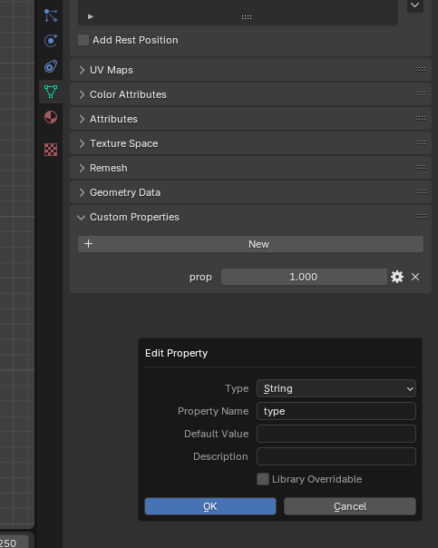
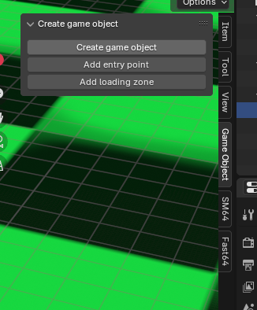

# Adding an entity

The mesh export plugin in this repo allows you to quickly add and edit entities. To add an entity to the system you to do the following steps.

1) Add the entity type to `src/scene/scene_definition.h`. You will need to add it to `enum entity_type_id` and create a struct definition that starts with the entity name and ends with `_definition`. For example, if you entity is called `foo` you would add `struct foo_definition`
2) Populate the definition struct with whatever info the entity needs. You will typically have `struct Vector3 position` and `struct Vector2 rotation`. You can also specify integers, strings, or even variables to read and write to the scripting system. More details on the field types are listed below
3) Add a `c` and `h` file for the new entity. A good folder for these is `src/entities`.
4) Create the entity structure and callback functions inside of the `c` and `h` files. If your entity is named `foo` you will need `struct foo`, `void foo_common_init()`, `void foo_common_destroy()`, `void foo_init(struct foo* foo, struct foo_definition* definition, entity_id id)`, and `void foo_destroy(struct foo* foo)`. And implement all those functions in the `c` file.
5) Add the entity to  `src/entity/entity_spawner.c` by importing the `h` file you added and insert your entity into `scene_entity_definitions`.

At this point the entity is in the source code be we want to link it to the level editor plugin. To do that save a mesh representing your entity to the `assets/meshes` folder. Then name the mesh in the blend file to be something that makes sense for the entity. It could be named `foo` or `foo_character`. Just avoid the default name of `Cube`.

Then select the mesh setting in blender and go to `Custom Properties`. Add a new property of name `type` that is a string and set the value of that property to be your entity name.

Once you created your object run `make assets/game_objects.json`. And your entity should show up in the `assets/game_objects.json` file. Close and reopen blender. If done correctly you should be able to add the entity using the [plugin](./installing_the_plugin.md).

Open a scene blend file and while in the viewport, select the `Game Object` tab and select `Create game object`

You entity should be in the list and selecting it will place it at the current position of the 3d cursor. Save the scene and the entity should be instantiated. You will need to implement the `_init` and `_destroy` functions before anything shows up in game though.